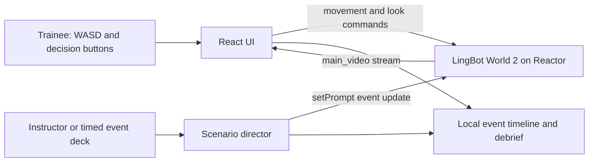

# ZERO-DAY RESCUE: two-hour implementation plan

## Technical choice

Use **LingBot World 2** through Reactor by default. It remains the best exact match because its documented interface combines:

- image-anchored generation;
- a continuous output video track;
- real-time WASD-style movement and look controls;
- live prompt replacement for atmosphere and events;
- a generated model package and scaffold.

Official starting command:

```powershell
npx create-reactor-app drillscape --model=lingbot-world-2
```

Official docs: [LingBot World 2 API](https://www.reactor.inc/models/lingbot-world-2/api).

Before the clock, A/B test **Happy Oyster Adventure**. It offers text-only world creation, persistent world IDs, WASD/look, diagonal movement, and semantic/world-advertised interaction verbs. Select it only if custom or advertised `Scan`, `Assist`, `Retreat`, and aftershock/environment actions produce dependable visible results. Happy Oyster's free-text direction and rewind belong to a separate Directing mode and cannot be assumed to coexist with Adventure navigation: [Happy Oyster API](https://www.reactor.inc/models/happy-oyster/api).

Do not use **LTX** as the world engine. Its current hosted endpoint creates a lip-synced speaking avatar from a portrait and script. A commander briefing/debrief is optional after the mission works, but it adds a second connection and conditions cannot change within a take: [LTX API](https://www.reactor.inc/models/ltx/api).

Keep `REACTOR_API_KEY` on the server. The browser should receive only a short-lived session token, following Reactor's documented token-exchange pattern.

## System shape



No database is required. Scenario events can be a local TypeScript array.

## Exact scope

### One scenario object

```ts
type ScenarioEvent = {
  id: string;
  title: string;
  atSeconds: number;
  worldPrompt: string;
  actions: Array<{
    id: string;
    label: string;
    consequencePrompt: string;
    feedback: string;
  }>;
};
```

Use transparent, authored feedback. Do not ask another model to determine whether an emergency action was medically or legally correct during the hackathon.

### Keyboard mapping

Map keydown/keyup to the SDK's movement and look methods. On key release, send the relevant idle/zero command so the camera does not continue moving. Throttle repeated events; do not send a model command for every browser key-repeat callback.

### State machine

```text
idle → connecting → ready → generating → event-active → generating → debrief
                       ↘ error/retry                     ↘ reset ↗
```

Disable scenario buttons until the model reports ready/started. Surface connection and command errors visibly; silent failure will look like a broken world.

## 120-minute schedule

| Time | Deliverable | Stop condition |
|---:|---|---|
| 0–10 min | Scaffold app, add API key locally, run baseline | Page loads without custom UI |
| 10–25 min | Server token endpoint and model connection | Ready state is visible |
| 25–40 min | Upload prepared seed, set prompt, start model, render output | Generated video plays |
| 40–55 min | WASD and arrow controls with correct idle behavior | Judge can navigate reliably |
| 55–70 min | Scenario event deck and one manual **Inject event** button | Scene changes mid-stream |
| 70–85 min | Three decision buttons, local timeline, 90-second timer | One complete exercise loop works |
| 85–100 min | Debrief screen, restart, disclaimer, error states | Demo has a clear ending and recovers |
| 100–110 min | Visual polish and full-screen layout | Objective and actions are readable at a glance |
| 110–120 min | Rehearse twice, record fallback clip/screenshots | A failure-tolerant 90-second demo is ready |

## Priority rule

At minute 60, the product must already show a world the user can navigate. At minute 90, it must already show a live hazard injection. If either is missing, cut scoring, speech, extra scenarios, and animation work.

## Reliability checklist

- Verify the account has access to `lingbot-world-2` before the clock starts.
- Also preflight one Happy Oyster Adventure world: record world-build time, save its `encrypted_world_id`, inspect `character_actions`/`environment_actions`, and test the four required mission verbs.
- Verify credits and measure actual startup time.
- Keep a known-good seed image locally; do not depend on an external image URL.
- Keep prompts short enough to edit live and pre-test all three transitions.
- Handle rejected commands and disconnected sessions on screen.
- Avoid starting multiple sessions on React re-renders.
- Stop/clean up the model connection when leaving the page.
- Prepare a fallback recording, but lead with the live demo.
- Use the same browser and network that will be used for judging.

## Minimum visual polish

- full-bleed generated video;
- a dark translucent objective/event rail;
- large action buttons reachable without a mouse if possible (`1`, `2`, `3`);
- a compact “LIVE WORLD” status indicator;
- small persistent disclosure: “Generated rehearsal; not a digital twin or safety certification.”

## Acceptance tests

1. With no prompt or image, Start stays disabled.
2. With a valid image and prompt, the stream appears and the ready/generating state is shown.
3. Pressing and releasing W starts and stops forward movement.
4. Arrow-left changes look direction and stops on release.
5. Injecting the aftershock event changes the current prompt without resetting the session.
6. Selecting an action adds exactly one timeline item and triggers its consequence prompt once.
7. The exercise reaches debrief after 90 seconds or a manual Finish action.
8. Restart clears local scenario state and starts from a clean model run.
9. A rejected command or lost connection produces a visible retry path.

## If LingBot World 2 access fails

Fallback in this order:

1. **Happy Oyster Adventure**, but only if it was preflighted: reopen the prepared persistent disaster world and use its proven action verbs. Do not attempt to redesign the mission around Directing mode during the event.
2. **LingBot**: same basic image + prompt + navigation shape, making it the closest low-cost substitution.
3. **Helios**: preserve live scenario event changes and continuous video, but drop the claim of navigable action-conditioned rehearsal.
4. **X2**: turn the webcam into a live “emergency conditions” view and keep decision prompts; this becomes a real-time video-editing demo and scores lower on World-Model Native.

Do not quietly switch to a pre-rendered video and retain the same world-model-native claim.

LTX is not a fallback for a failed world session. It can preserve a spoken briefing, but it cannot preserve the navigable simulation claim.
